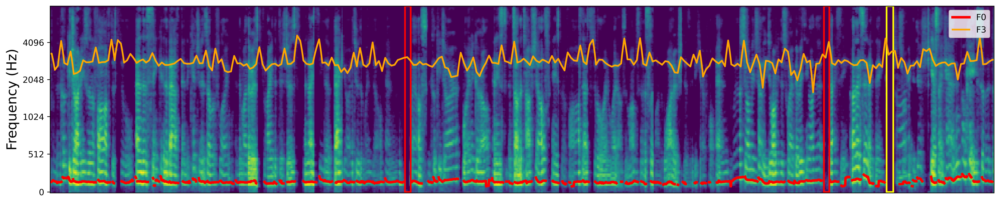

# Acoustic Explainability Framework

This repository introduces a model-agnostic explainability framework designed for acoustic deep learning pipelines. The framework integrates advanced visualization techniques, such as spectrogram analysis and SHAP (SHapley Additive exPlanations), to identify and visualize acoustic cues associated with desired model outcomes (e.g., cognitive impairment). It comprises three complementary explanation layers:

- **Audio Spectrogram:** Visualizes the energy of frequency components over time.
- **SHAP-based Spectrogram:** Highlights time spans that are most informative for the predicted outcome.
- **Explainable Acoustic/Temporal Features:** Provides deeper insights into how key acoustic and temporal features relate to the desired outcome (e.g., cognitive status).

The output of this framework is a spectrogram visualization that emphasizes informative acoustic and temporal features, accompanied by human-interpretable explanations. Additionally, this framework includes linguistic transformer explainability. For more details, refer to the [Linguistic Explainability Framework repository](https://github.com/SpeechCARE/SpeechCARE_Linguistic_Explainability_Framework.git).

Below is a sample output of our explainability framework applied to a classification task from the [SpeechCARE challenge](https://github.com/SpeechCARE), where the subject's class was Mild Cognitive Impairment (MCI).



---

## ⚙️ Configuring `*.yml`

Before starting the training process, update the **`data/model_config.yml`** and **`data/pause_config.yml`** files with the appropriate paths and settings.

### ✅ Set Pretrained Checkpoints

Choose a pretrained acoustic transformer model by specifying its checkpoint in the configuration file. The pipeline supports various self-supervised speech models:

```yaml
speech_transformer_chp: "PATH/TO/PRETRAINED/MODEL/CHECKPOINTS"
```

### ✅ Set Training Hyperparameters

Change other training parameters or model configs like epoch, learning rate and etc.

---

## 🛠️ Usage

To use the provided explainability methods (SHAP) on an acoustic input, you can run the `test.py` file using the following bash script. This script generates explanations for a given audio sample and saves the results.

### Running the Script

Use the following command to run the `test.py` file:

```bash
!python SpeechCARE_Acoustic_Explainability_Framework/test/test.py --model_checkpoint $CHECKPOINTS_FILE \
                                                                 --audio_path $AUDIO_PATH \
                                                                 --demography_info $DEMOGRAPHIC_INFO \
                                                                 --fig_save_path $FIG_SAVE_PATH \
                                                                 --word_segments $WORD_SEGMENTS_PATH \
                                                                 --min_pause_duration 0.15
```

### Arguments

- **`--model_checkpoint`**:  
  Path to the pretrained TBNet model weights. This file contains the trained model parameters required for inference.

- **`--audio_path`**:  
  Path to the audio sample for which you want to generate explanations. The audio file should be in a supported format (e.g., WAV).

- **`--demography_info`**:  
  A scalar value (e.g., age) associated with the audio sample. This information can be used as additional input for the model, if required.

- **`--fig_save_path`**:  
  Path to save the generated spectrogram image with SHAP values visualized. This image highlights the parts of the audio signal that the model attended to most.

- **`--min_pause_duration `**:  
  A scalar value that defines the minimum duration required for a pause to be considered as valid.

- **`--word_segments` (optional)**:  
  A JSON file containing the words in the audio file along with their respective start and end times. This file is used to detect pauses in the audio, which are important indicators for classification. The JSON file should have the following format:
  ```json
  [
    { "word": "example", "start": 0.0, "end": 0.5 },
    { "word": "audio", "start": 0.6, "end": 1.0 }
  ]
  ```

---

## 🚀 Installation

You can install the required dependencies using the `requirements.txt` file:

```bash
pip install -r requirements.txt
```

---

## 📁 Repository Structure

```
├── data/                       # Contains necessary data
├── dataset/                    # Dataset architecture
├── models/                      # Model architecture
├── pauseExtraction/             # Contains code to extract pauses from audio input
├── utils/                      # Utility scripts for preprocessing and evaluation
├── test/                 # A sample script for using the explanation on acoustic data
├── result.ipynb                      # A notebook sample to show the output of the explanation method used
├── requirements.txt              # Dependencies for the project
```

---
