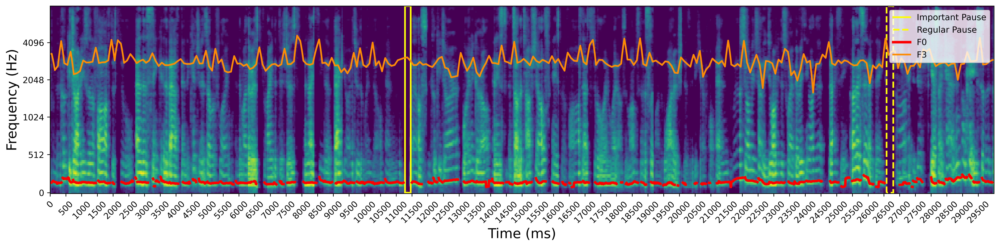

# Acoustic Explainability Framework

This repository introduces a model-agnostic explainability framework designed for acoustic deep learning pipelines. The framework integrates advanced visualization techniques, such as spectrogram analysis and SHAP (SHapley Additive exPlanations), to identify and visualize acoustic cues associated with desired model outcomes (e.g., cognitive impairment). It comprises three complementary explanation layers:

- **Audio Spectrogram:** Visualizes the energy of frequency components over time.
- **SHAP-based Spectrogram:** Highlights time spans that are most informative for the predicted outcome.
- **Explainable Acoustic/Temporal Features:** Provides deeper insights into how key acoustic and temporal features relate to the desired outcome (e.g., cognitive status).

The output of this framework is a spectrogram visualization that emphasizes informative acoustic and temporal features, accompanied by human-interpretable explanations.

The framework also includes linguistic explainability. For more details, refer to the [Linguistic Explainability Framework repository](https://github.com/SpeechCARE/SpeechCARE_Linguistic_Explainability_Framework.git).

Below is a sample output of our acoustic explainability framework applied to a classification task from the [SpeechCARE challenge](https://github.com/SpeechCARE), where the subject's class was Mild Cognitive Impairment (MCI).



---

## 📁 Repository Structure

```
├── data/                       # Contains necessary data
├── modelCheckpoints/           # Contains checkpoints of the pretrained model
├── dataset/                    # Dataset architecture
├── model/                      # Model architecture
├── pauseExtraction/             # Contains code to extract pauses from audio input
├── utils/                      # Utility scripts for preprocessing and evaluation
├── test/                 # A sample script for using the explanation on acoustic data
├── result.ipynb                      # A notebook sample to show the output of the explanation method used
├── requirements.txt              # Dependencies for the project
```

---

## ⚙️ Configuration Files `*.yml`

Before running the project, you may need to adjust these configuration files:

### ✅ data/model_config.yaml - Core Model Parameters

When to modify: Change these if you want to:

- Use different pretrained models

- Adjust training hyperparameters (batch size, learning rate, etc.)

- Modify model architecture settings

### ✅ data/pause_config.yaml - Audio Processing

When to modify: Only adjust these if you:

- Need to process audio transcriptions (skip if you have existing transcripts)

- Want to use GPU (device: "cuda")

- Prefer a different Whisper model size

**Default Note**: Both files come with working defaults - you can run the project immediately without changes for basic usage.

---

## 🚀 Installation

You can install the required dependencies using the `requirements.txt` file:

```bash
pip install -r requirements.txt
```

---

## 🛠️ Explainability Testing

Run SHAP-based explainability analysis on acoustic inputs using the provided test script. This generates model explanations and saves visualizations.

### Quick Start

```bash
python test/test.py \
  --model_checkpoint path/to/model.pt \
  --audio_path path/to/audio.wav \
  --demography_info 65 \          # Age of speaker
  --fig_save_path results/result.png \      # Path to save result image
  --min_pause_duration 0.15       # Minimum pause threshold (seconds)

```

#### 📋 Arguments Overview

| Argument               | Required | Description                                                                                           |
| ---------------------- | -------- | ----------------------------------------------------------------------------------------------------- |
| `--model_checkpoint`   | ✅       | Path to trained TBNet model weights (`.pt` file)                                                      |
| `--audio_path`         | ✅       | Input audio file path (WAV format recommended)                                                        |
| `--demography_info`    | ✅       | Speaker demographic value (e.g., age as integer)                                                      |
| `--fig_save_path`      | ✅       | Directory to save explanation visualizations                                                          |
| `--min_pause_duration` | ✅       | Minimum pause length (seconds) for detection                                                          |
| `--word_segments`      | ❌       | Optional JSON file with word timestamps:<br> `[{"word": "example", "start": 0.0, "end": 0.5 } , ...]` |

**_Note:_** When omitting --word_segments, the script automatically transcribes audio using the Whisper model specified in pause_config.yaml.

---

## 📖 Detailed Tutorial & Examples

For a complete step-by-step guide with sample data demonstrations and output visualizations, see the Jupyter notebook:
`result.ipynb`
